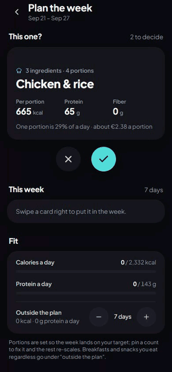
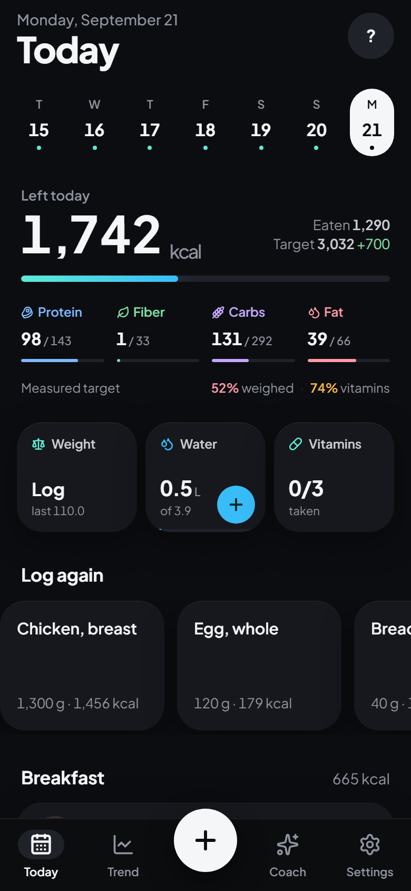
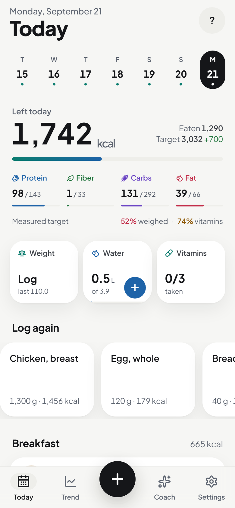
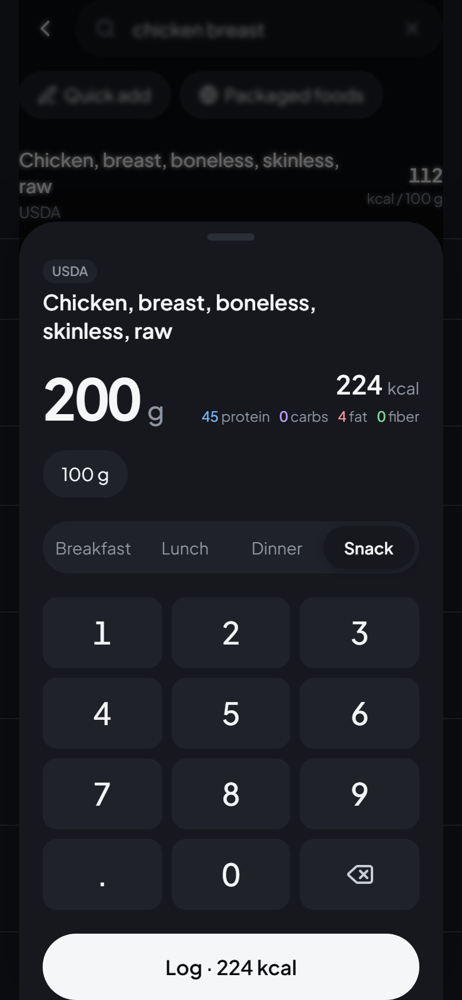
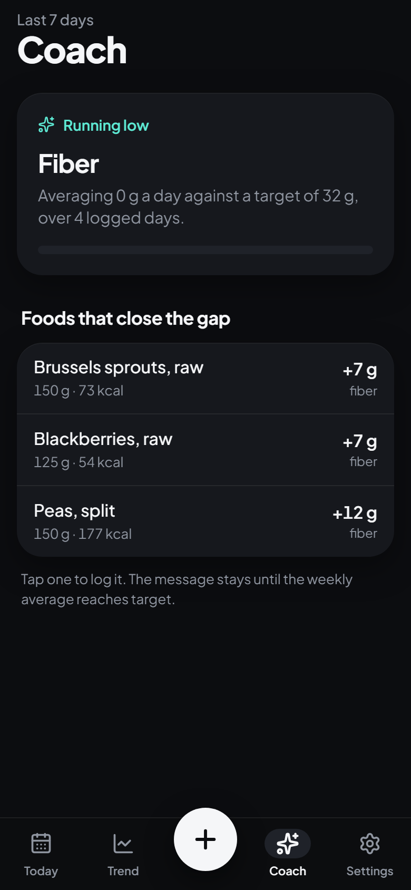
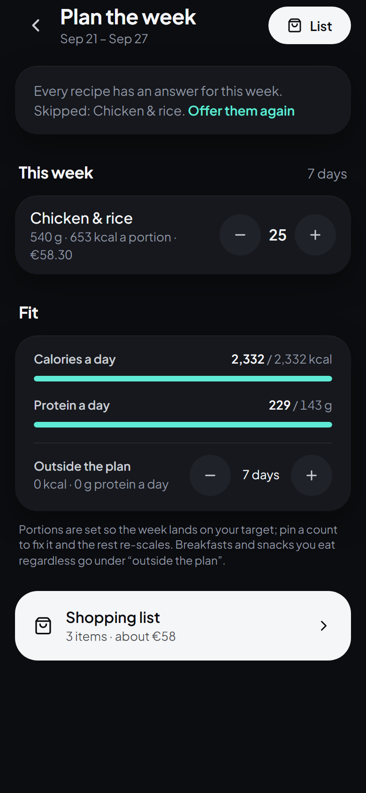
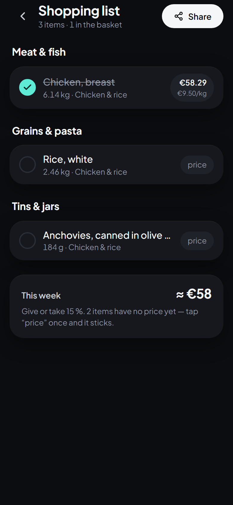

# Kalib

[](https://github.com/IIxoskeletonII/Kalib/actions/workflows/ci.yml)
[](LICENSE)

A personal, local-first nutrition tracker that **measures** your maintenance calories from your
own weigh-ins and logs instead of guessing them from a formula — and coaches you toward the
targets you keep missing. Progressive web app, works offline, costs nothing to run.

<p align="center">
  
</p>

<p align="center">
  
  
  
  
  
  
</p>

## Try it

**[kalib.kalib.workers.dev](https://kalib.kalib.workers.dev)** — open it on a phone, go through
the one-screen onboarding, and log. Everything works without an account; it all stays in your
browser. Sign-up is open: create an account under Settings → Sync if you want your data mirrored
between phones (each account only ever sees its own rows), and delete it from the same place
whenever you like.

**Describe a meal** runs on a real vision model, and there is **$5 of OpenRouter credit loaded
for anyone who wants to try it** — go ahead. Hard caps on the server (30 estimates per account
per day, 100 per day in total, ~€0.0007 each) mean the credit lasts and nobody can run it dry
in an afternoon. If it says "paused until tomorrow", the day's hundred are gone.

It is a personal project on free tiers: no uptime promise, no support desk, and not medical
advice. Install it to the Home Screen on iOS for offline use and reminders.

## Why

I built Kalib because I wanted logging and tracking my macros to be effortless, and I could not
find a good free app that offered everything I wanted: a food database that works offline, a
maintenance-calorie number that comes from *my* data rather than a formula, honest uncertainty
instead of false precision, fiber treated as seriously as protein, and no subscription standing
between me and my own numbers. So I built it myself. It runs on my phone and my wife's, on a
free tier, and the source is here for anyone who wants the same.

## What it does

- **Logging in seconds** — offline USDA database (13 k foods: Foundation, SR Legacy and FNDDS
  dishes as eaten), packaged products from Open Food Facts by search or **barcode photo**
  (decoded on-device; scanned offline, looked up when the connection returns), your own foods,
  a custom number pad (no OS keyboard), amounts in g / ml / oz / fl oz with liquids opening in
  ml, one-tap "log again" tiles, swipe to delete (with undo) or to log again, quick manual entry.
- **Targets that calibrate to you** — formula targets while calibrating, then from day 24 a
  measured TDEE from the weight trend and logged intake over a 28-day window, with a 95 %
  interval, guard rails (±150 kcal per weekly step, a hold-and-explain card when the measurement
  is >600 kcal from the formula) and a synthetic 90-day ground-truth test behind it (SPEC §4).
  Fiber is a first-class target next to protein.
- **Weekly banking** — a big day is spread across the week within bounds (never more than
  300 kcal off a day, never below the safety floor, one rollover then forgiven); an under-day
  rolls forward. The ring runs on the banked target.
- **Weight trend, not scale noise** — exponentially smoothed trend, raw readings hidden by default.
- **Coach** — after a few full days it finds what is running short (protein, fiber, then
  micronutrients when the data is good enough) and names everyday foods that close the gap.
  The same tab carries the week in review (calories, protein, fiber, trend, adherence) and a
  micronutrient panel that judges each nutrient only on days whose food carried data for it.
- **Honest numbers** — every day shows how much of its calories were weighed and how much
  carried vitamin data (SPEC §7.4), and names the entries behind the uncertainty.
- **Recipes and batches** — weigh ingredients as you cook, weigh the pot, say how many portions;
  every recipe becomes one of your foods, and a cooked batch logs a portion in one tap from
  Today with the count of portions left.
- **Water and supplements** — one tap adds a glass toward the 35 ml/kg target; a daily checklist
  for creatine, vitamins and minerals with a suggested dose worked out from sex, age and weight
  (NIH ODS / EFSA / ISSN references, shown with their basis). Micronutrient supplements count
  toward the coach's gap detection.
- **Describe a meal** — type "2 eggs, toast with butter, a latte" (photo optional) and get
  it back as items: anything that exists in your offline database is grounded in real USDA or
  own-food numbers at the model's portion; only the rest stays a model estimate with a range
  and a deliberate +10 % bias. Adjust grams, log all in one tap, promote a corrected estimate
  to a food of your own (SPEC §9).
- **Meal planner** — swipe through your recipes (right = this week, left = not), portion counts
  scaled so the week lands on your targets with room for the meals outside the plan, a shopping
  list by aisle with prices you enter once and a ±15 % weekly total, and a cooking mode that
  ends by weighing the pot into a batch (SPEC §18).
- **Discover** — set a weekly budget, tick preference cards (fakeaway, trending now, high
  protein, big plate, quick, air fryer, one pot, meal prep, vegetarian, low carb, cheap,
  Italian, Asian, Mexican…), say what to avoid, and get new recipes written for your targets.
  Turning a card down moves the next batch away from it: the rejection goes back with what it
  was made of, and anything that still reads as the same dish is dropped before you see it. The deck refills itself: turn cards down and more arrive until you have as many
  as you asked to keep (capped per week so it cannot spend without end) — themed on what food publishers posted **this week** (thirteen public feeds,
  refreshed every Monday by the Worker) and mixed with recipes other people kept, from a bank
  that grows with every accepted card. Swipe right and it becomes yours: every ingredient is
  matched to the offline database (the rest become own foods with the model's numbers), the
  steps carry their times and oven temperatures, prices land as labelled estimates, and the
  shopping list reads *≈ cost of budget*. Tap a row in the week to see its ingredients scaled
  for the week and its steps without leaving the page, swipe it left to take it out, and open
  *Fit → Details* for the week read back in portions, days and money with the one target it is
  furthest from (SPEC §18.6).
- **A budget that holds** — every recipe is priced from the prices on file and portions are
  trimmed (worst calories-per-euro first, pinned counts untouched) until the week fits, then
  refilled with whatever still fits. Verified by simulation: 80 plan/budget combinations, never
  over budget, the shopping list agreeing with the projection to the cent.
- **Reminders that know the day** — the evening check covers food, supplements and water, and
  names what is left; Settings shows when the next one is due, when the last one went, and why
  one failed if it did.
- **Cut, maintain, recomp or bulk** — a lean surplus of 5–15 % sized from the gain rate, the
  same protein and fat rules, switchable on a schedule.
- **Week in review** — one page with the week's calories, protein, fiber, trend, measured burn
  and what ran low, shareable as plain text for a coach or a doctor.
- **Household recipes** — share a recipe as a link or code; the other account imports it with
  every ingredient resolved (database foods by id, own foods embedded).
- **Reminders** — a weigh-in nudge and an evening "nothing logged" check, each at your time and
  only when the thing is still undone, via Web Push from the Worker (Home Screen app on iOS 16.4+).
- **Your data stays yours** — everything lives in IndexedDB on the device; CSV and JSON export;
  searches that found nothing are kept so the database grows from real use; one button deletes
  the account and every row on the server.

Product spec: [`SPEC.md`](SPEC.md) · design system: [`design-system/kalib/MASTER.md`](design-system/kalib/MASTER.md) ·
code conventions: [`CLAUDE.md`](CLAUDE.md) · threat model: [`SECURITY.md`](SECURITY.md).

## Stack

React 19 · Vite · TypeScript (strict) · Tailwind v4 · Dexie (IndexedDB) · uPlot · vite-plugin-pwa ·
Cloudflare Workers (static assets + a small API: Open Food Facts proxy, meal estimation,
Web Push) · Supabase (auth + a row-per-row mirror for sync; optional).

```
src/core/       pure formulas + types, fully unit-tested      src/db/         Dexie schema, repos, seed
src/services/   orchestration (targets, logging, coach, off)  src/platform/   camera / share / push adapters
src/hooks/      live queries                                  src/screens/, src/components/   UI
worker/         Cloudflare Worker (assets + /api/*)           scripts/        USDA ETL, icons, screenshots
```

## Run

```sh
npm install
npm run dev          # http://localhost:5173 (add --host to test on a phone over LAN)
npm test             # 228 unit tests: every formula in SPEC §3/§4/§5/§16/§18, repos, the Worker
npm run build        # typecheck + production build → dist/
npm run e2e          # Playwright against the build: day one end to end, and fully offline
npm run demo:gif     # re-records the README demo from the dev server (Chrome + Pillow)
```

CI runs typecheck, lint, Prettier, unit tests, the build, a Worker config dry-run, the browser
smoke tests and a production dependency audit on every push. Deploys stay manual.

## Performance

Lighthouse 12, mobile emulation against the production build, returning visit:

| Throttle                                            | Interactive | LCP    | Blocking | Score |
| --------------------------------------------------- | ----------- | ------ | -------- | ----- |
| Regular 4G (70 ms RTT, 10 Mbps, 2× CPU slowdown)    | 0.84 s      | 0.84 s | 0 ms     | 100   |
| Lighthouse "slow 4G" (150 ms, 1.6 Mbps, 4× slowdown) | 2.6 s       | 2.6 s  | 6 ms     | 95    |

The first launch also downloads the food database (~1.2 MB compressed) and writes 13 k rows;
that runs in small chunks after the first screen is interactive, so it does not move the numbers.

## Food database

`public/data/foods-*.json` is generated from USDA FoodData Central (Foundation Foods, a filtered
slice of SR Legacy, and FNDDS) and committed. Regenerate after changing `scripts/seed-usda.ts` or
`src/core/nutrients.ts`, then bump `SEED_VERSION` in `src/db/seed.ts` so installed clients reload:

```sh
npm run seed:usda
```

Packaged foods come from Open Food Facts through `/api/off/search`, which re-ranks OFF's results
for label completeness and popularity (see `worker/off.ts`). Picked products are cached locally.

## Cloud sync (optional)

Sign-in is email + password (Supabase Auth, no SMTP needed); sync is last-write-wins by
`updated_at` with soft deletes, over the same rows the device keeps. Each account only ever sees
its own rows (RLS), and a phone binds to the first account it syncs with. Without the two
environment variables the build runs local-only and Settings says so.

1. Create a free Supabase project, open the SQL editor and run every file in
   `supabase/migrations/` in order (`0001_init.sql` … `0006_discover.sql`).
2. Authentication → Providers → Email: turn **Confirm email** off (accounts sign in immediately).
3. Authentication → URL configuration: Site URL = the app's URL; add it to Redirect URLs (password reset).
4. Copy `.env.example` to `.env.local` with the project URL and publishable key, then `npm run deploy`.
5. Optional: Authentication → Sign In / Providers → **Allow new users to sign up** off, if the
   deployment is meant for a fixed set of people. (The public deployment leaves it on.)

The Worker needs the same two values to verify sessions (estimation and reminders are for
signed-in users only). Upload `.env.local` as it is — the Worker accepts the `VITE_` names:

```sh
npx wrangler secret bulk .env.local
```

## Meal estimation (optional)

`/api/estimate` calls a vision model through OpenRouter; the key lives only on the Worker, and
the endpoint requires a signed-in user, is rate-limited, and stops at 30 estimates per person and
100 in total per day (`ESTIMATE_DAILY_*` in `wrangler.jsonc`). Every account on the deployment
shares the one key — the public deployment runs this way on a small, capped balance. To restrict
it to particular people instead, list their emails in `ESTIMATE_ALLOWED_EMAILS` (a var in
`wrangler.jsonc`, or a secret of that name).

1. Create an OpenRouter account, add a few euros of credit and create an API key.
2. `npx wrangler secret put OPENROUTER_API_KEY` and paste the key when prompted.
3. The model id is `VISION_MODEL` in `wrangler.jsonc` (default `google/gemini-3.1-flash-lite`,
   about €0.0007 per estimate with a photo). Without the secret the screen explains what is missing.
4. Recipe suggestions use `TEXT_MODEL` (same default; a batch of four recipes costs about
   €0.005 and counts as one estimate toward the daily caps). This week's publisher titles are
   fetched by the Monday cron from the RSS feeds listed in `worker/trends.ts` — free, no keys —
   and kept in KV alongside the bank of accepted recipes.

## Reminders (optional)

Web Push, sent by the Worker's cron every 10 minutes to subscriptions kept in KV. Subscribing
requires a signed-in user; the Worker only ever posts to the browsers' own push services.

1. `npx wrangler kv namespace create PUSH` and paste the printed `id` into `kv_namespaces` in
   `wrangler.jsonc`.
2. Generate a VAPID key pair (any Web Push tool); put the public key in `wrangler.jsonc` →
   `VAPID_PUBLIC_KEY` and the private `d` value in a secret: `npx wrangler secret put VAPID_PRIVATE_KEY`.
3. Deploy. Settings → Reminders turns on from the installed app; the card shows whether the
   server still holds this phone's subscription (and re-registers it if not), and **Send a test**
   reports the push service's exact answer, so a silent failure has somewhere to be seen.

## Deploy

One-time: `npx wrangler login`. Then `npm run deploy` builds and uploads `dist/` plus the Worker.
On the iPhone: open the URL in Safari → Share → **Add to Home Screen**. Installed, it runs
standalone and offline; the food database downloads once on first launch and is cached.

## Verifying without a phone

`scripts/shot.ts` drives headless Chrome over CDP, waits for the app to mount, evaluates JS and
screenshots at phone size in either colour scheme:

```sh
npm run shot -- http://localhost:5173/ out.png --wait 1500 --scheme light
npm run shot -- http://localhost:5173/log out.png --eval-file .cache/search.js
```

## Design skills

The UI was built against Anthropic's `frontend-design`, `impeccable` and Vercel's
`web-design-guidelines` skills (not committed). To reinstall for a Claude Code session:

```sh
npx skills add anthropics/skills --skill frontend-design
npx skills add pbakaus/impeccable
npx skills add vercel-labs/agent-skills --skill web-design-guidelines
```

## Data sources

U.S. Department of Agriculture, Agricultural Research Service — FoodData Central (Foundation
Foods, SR Legacy, FNDDS). Open Food Facts — Open Database License (ODbL).

Not medical advice. Targets are general-population formulas.
